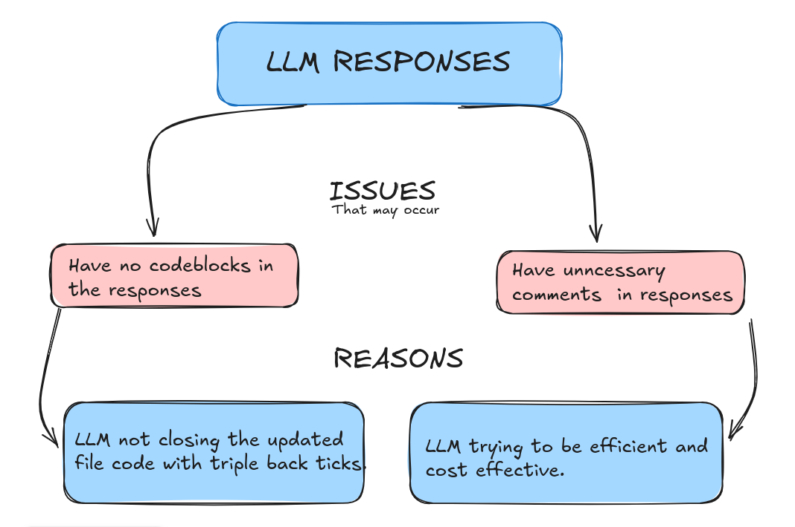
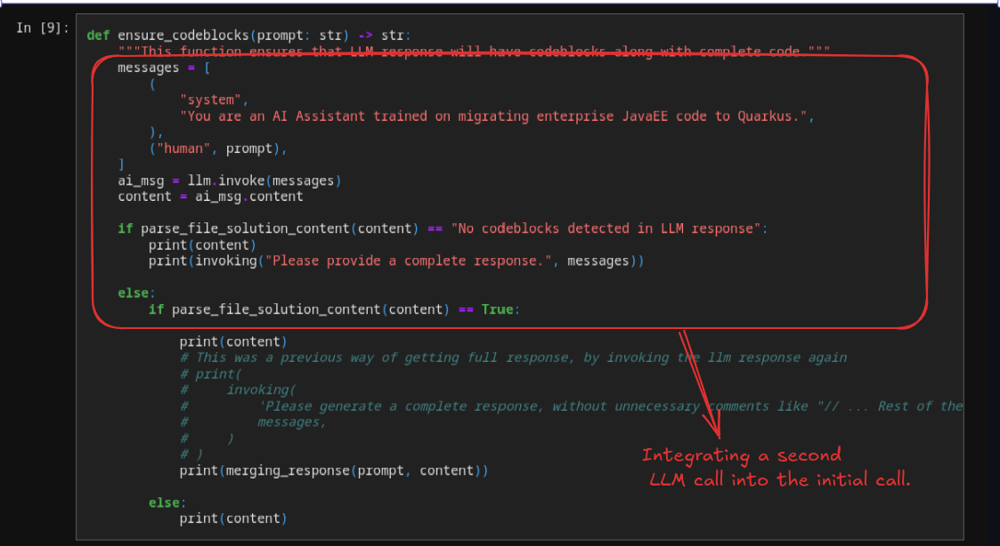
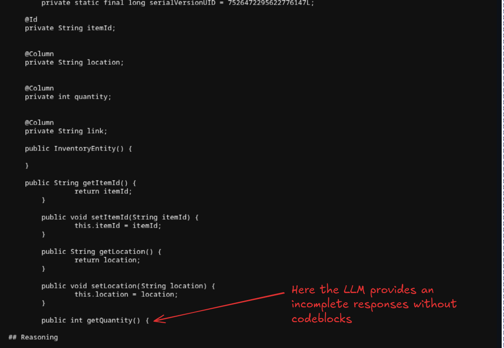
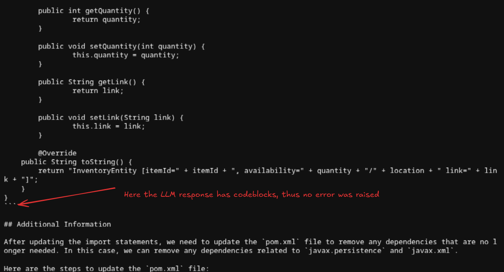
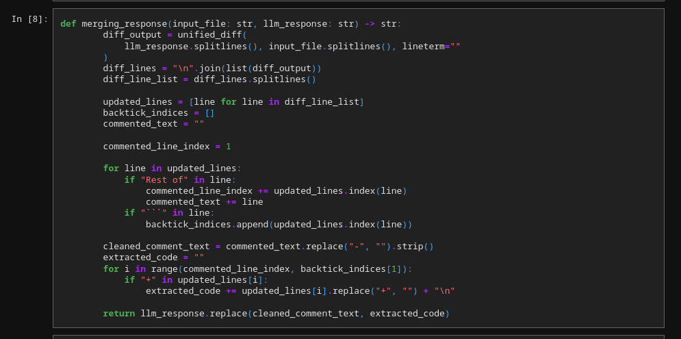
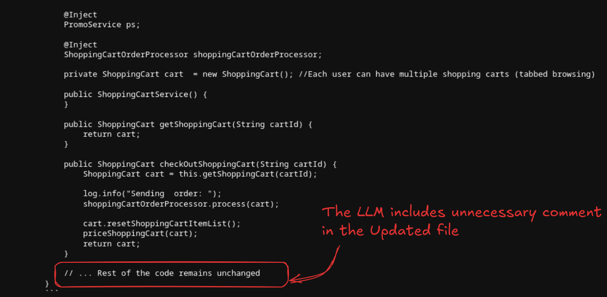
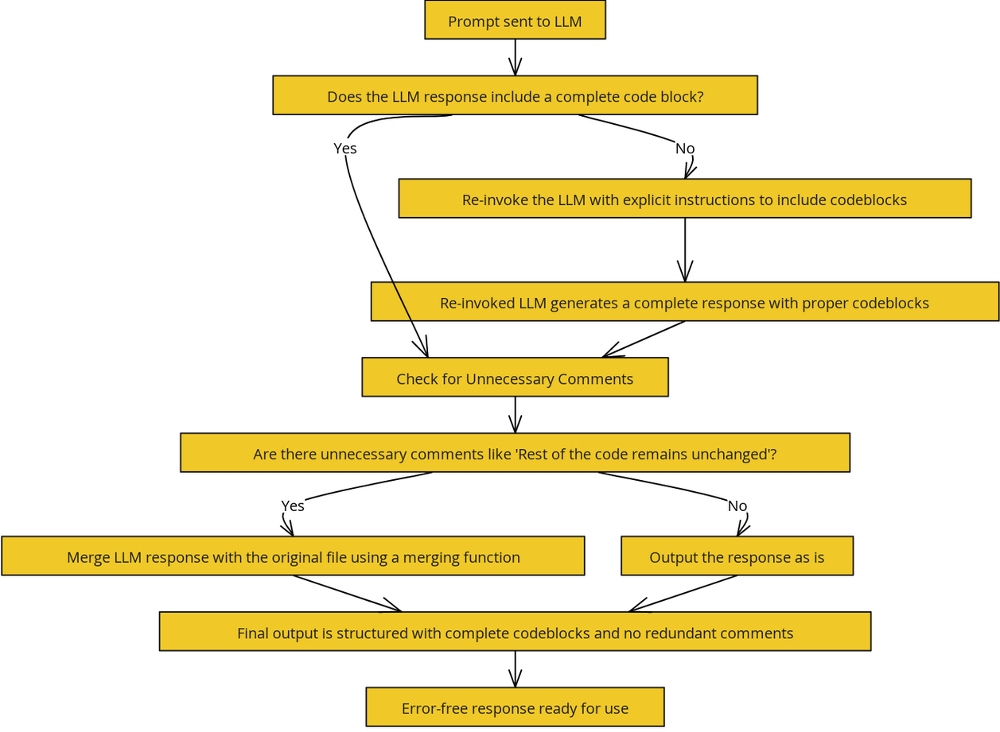

# Resolving Issue #350: Addressing 'No Codeblock' Errors in LLM Responses
## Introduction
This documentation outlines the solution to the "No Codeblock" issue and the problem of unnecessary comments in responses from the LLM. These issues impact the usability and clarity of responses generated by the model, particularly in code-related outputs.

A [Jupyter Notebook](https://github.com/devjpt23/promptEng/blob/main/langchain-implementation.ipynb) is provided to illustrate the debugging and solution process, showcasing code that was subsequently implemented into the KAI system. This notebook also demonstrates the types of responses we can expect from the LLM before and after implementing the fixes.

The "No Codeblock" issue was first reported in [issue #350](https://github.com/konveyor/kai/issues/350) and has been a recurring concern. Unnecessary comments further complicate the usability of responses by adding noise that developers must filter out.

This document will:
1) Explore the two primary problems encountered in LLM responses.
2) Present solutions developed to address these problems effectively.
3) Discuss the impact of these fixes on the quality of the LLM outputs.

By the end of this documentation, readers will gain a clear understanding of these challenges and the strategies employed to overcome them, ensuring cleaner and more reliable LLM responses in the future.

## 1) "No codeblocks" error

When we send a prompt to the LLM, we expect a structured response comprising three main sections:

* **## Reasoning**: The LLM's thought process or justification for changes.
* **## Updated File**: The section where the updated code appears, typically encapsulated within triple backticks (```).
* **## Additional Information**: Any extra details provided by the LLM.

The updated code is placed in the "## Updated File" section, and it should be wrapped within triple backticks to indicate a complete code block. This ensures that the code is correctly recognized and processed.
Now that we have a basic understanding of the response structure, we can delve into what causes the "No Codeblock" error.

### What causes this “No codeblock” error?
The "No Codeblock" error typically occurs when the **## Updated File** section does not end with triple backticks. When the LLM fails to close the code block properly, the response is interpreted as missing an updated code section, resulting in a "No Codeblock" error.

In summary:
* The response must include a properly closed code block in the "## Updated File" section.
* If this closing marker (```) is missing, the response appears incomplete, and the error is triggered.

## 2) Unnecessary Comments in Updated Code
In [issue #350](https://github.com/konveyor/kai/issues/350), we observed a secondary problem after solving the "No Codeblock" error. Sometimes, even when the code block is correctly structured, [the LLM response](https://gist.github.com/jwmatthews/0b366ffa4ff8fe2ed89638552e9972e9#file-llm_result-L58) includes unnecessary comments, such as “// Rest of the code remains unchanged.” While these comments don’t prevent the response from being processed, they add clutter and may affect readability or processing of the updated code.

### Causes of Unnecessary Comments
Several factors may lead the LLM to include these redundant comments:
* **Prompt Ambiguity** The prompt may not be guiding the LLM to produce results which contain no unnecessary comments.
* **Prompt Efficiency in Long Responses**: In responses where multiple sections of code may be identical, the model saves tokens by providing a single comment rather than generating redundant code. This token-saving approach is useful for complex prompts where the model is constrained by a token cap.

Despite having identified several factors for these unnecessary comments the        main cause of the issue is yet to be determined.

### Current Understanding
To summarize what we know:
* **No Codeblock Error**: This error arises when the LLM response in the "## Updated File" section lacks closing triple backticks, making the code appear incomplete.
* **Unnecessary Comments**: Although the "No Codeblock" error may be resolved, the LLM may still add redundant comments like "Rest of the code remains unchanged."



## Solutions for the errors
### 1) Solving the "No codeblocks" issue
To resolve the "No Codeblocks" issue, I implemented a straightforward solution: simply re-invoking the LLM with a prompt explicitly instructing it to provide a complete response with codeblocks. This approach proved effective, as the LLM started giving complete responses with codeblocks as seen in the [Notebook](https://github.com/devjpt23/promptEng/blob/main/langchain-implementation.ipynb).

Above snippet from the [Jupyter Notebook](https://github.com/devjpt23/promptEng/blob/main/langchain-implementation.ipynb), this shows how we invoke the LLM again providing a complete response.

### Example of LLM responses

According to this snippet we can see that one of the responses by the LLM is incomplete. The “## Updated File” section does not end with triple backticks, therefore we now know that this can cause the “No codeblocks” error.

According to this snippet we can see that the LLM provides a response that ends with triple backtick

This approach proved to be the only effective solution to the “No Codeblocks” issue, as there is no direct way to resolve it without calling the LLM twice. Although not the most cost-efficient solution, it consistently achieves the desired result. (Note: Later sections will cover alternative approaches that also show some promise. However,  we’ll proceed with this method of re-invoking the LLM.)

With the "No Codeblocks" issue resolved, the next step is to address the presence of unnecessary comments, such as “// Rest of the code remains the same.”

### 2) Eliminating the comment “// Rest of the code remains the same” to resolve the issue
While the “No Codeblocks” issue was relatively straightforward to solve, removing unnecessary comments like “// Rest of the code remains the same” presented a more complex challenge. Initially, I approached this by re-invoking the LLM to obtain a full response, which worked but was not cost-effective, as it nearly doubled the token usage to retrieve a correct response.
After examining the code closely, I questioned why the LLM was producing these redundant comments. After extensive consideration, I hypothesized that an unclear prompt might be causing these incomplete responses with unnecessary comments.

### Refining the prompt
To test this theory, I experimented with modifying the prompt in the LLM playground. I observed that the LLM sometimes struggled to fully understand the task, leading to incomplete responses or comments on unchanged code as I played around with prompts and its responses in the [Groq Playground](https://console.groq.com/playground?model=mixtral-8x7b-32768).

This [notebook](https://github.com/devjpt23/promptEng/blob/main/new-prompt-testing.ipynb) includes the new prompt that I tested before implementing it in KAI. As seen in the notebook the new prompt worked out and no “No codeblocks…” error was raised. Also no unnecessary comments were included in any of the LLM responses. 

Encouraged by the initial success of this refined prompt, I considered abandoning the previous solution of invoking the LLM twice, as this new approach appeared more token-efficient. However, when I implemented the updated prompt in KAI and ran tests on files in the coolstore, I noticed inconsistent results. Occasionally, the LLM responses were perfect, but in subsequent runs, the “No Codeblocks” and unnecessary comments issues reappeared. Despite extensive prompt tweaking, the results remained unpredictable, likely due to a lack of LLM fine-tuning to generate standard responses for this new prompt. Faced with this inconsistency, I decided to explore another approach.


### Merging the prompt and LLM response
Given that the comments like “// Rest of the code remains unchanged” indicate unchanged parts of the input file, I realized I could use these sections directly from the input file itself. I developed a function to merge the LLM response with the input file content, incorporating only the actual updates from the LLM response while preserving other parts of the original file.

Above is the function responsible for merging the input file given to the LLM and the  LLM response.
According to this snippet we can see that we have an unnecessary comment in the updated file.

Once we call the merge function we can see that we get a new response that does not have this comment and also contains codeblocks therefore there is no error raised here.

## Final Thoughts and Key Takeaways
In the above diagram we can see the final walkthrough of the LLM will generate its responses without any errors

Up to this point, we have walked through diagnosing and resolving the 'No Codeblocks' and 'Unnecessary Comments' issues, emphasizing a structured approach that balances consistency and cost-effectiveness. By re-invoking the LLM when necessary, refining prompts, and implementing a merge function, we have developed a robust solution that addresses both code formatting and response clarity.

Key takeaways include:
* **Prompt Clarity Matters**: Small adjustments to the prompt can significantly impact LLM responses. Clear, direct prompts lead to more consistent outputs.
* **Cost-Efficiency vs. Consistency**: While re-invoking the LLM adds token usage, it guarantees completeness. When balancing cost and quality, sometimes higher costs are necessary for consistent results.
* **Merge function**: Implementing a merging function not only addresses the issue but adds flexibility by allowing control over final outputs, helping prevent repetitive calls to the LLM.

## Future Improvements
While the current solution is effective, further optimizations could reduce token usage and enhance reliability. Here are potential future improvements:
* **Fine-Tuning the LLM**: Training the LLM on specific patterns for standardized code responses would likely reduce the need for re-invocations and eliminate redundant comments.
* **Adaptive Prompting**: Implementing adaptive prompting based on the LLM’s initial response could help refine the results without an automatic second invocation, saving tokens. Some ways could be: 
    * Allowing intermediate steps, this allows the LLM to “think out loud” and can carry out multi-step reasoning which can increase the accuracy and consistency of the result.
    * Integration of few-shot prompting to allow the LLM to checkout how other examples were solved before. And this will allow the LLM to learn from its mistakes.
